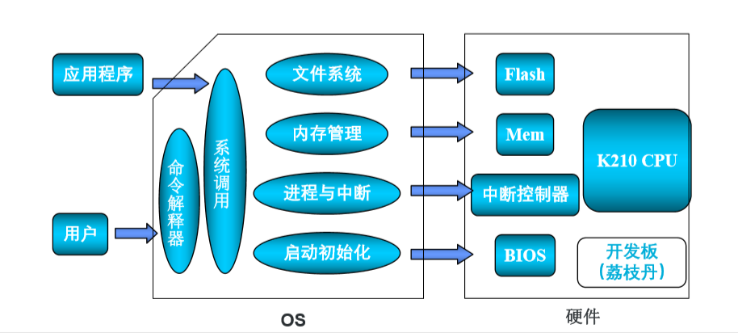

### 整体感受：

大抵都是介绍rcore和xv6移植的方法，他们所遇到的痛点和我们想到的痛点基本一样，最大的区别是我们还没有移植成功。


## 学习流程：

1.首先移植成功一个版本

2.从rcoreV2版本开始认识


### 赛制介绍:

##### 1.评测过程:

参赛队实现的OS Kernel能访问有规定的文件系统上的应用程序和数据。 基准测试程序放在规定的文件系统上。参赛队在完成规定的文件系统情 况下，可实现新的文件系统，提高测试程序的执行性能。




• 启动和系统初始化 

• 内存管理 

• 进程管理和中断异常机制 

• 系统调用 

• 文件系统（SimpleFS or Other better FS） 

• 命令解释程序


命令行解释程序：在rcorev2上有专门的利用文件系统写的user shell

```rust
// usr/rust/src/bin/user_shell.rs

#![no_std]
#![no_main]

extern crate alloc;

#[macro_use]
extern crate user;

const LF: u8 = 0x0au8;
const CR: u8 = 0x0du8;
const DL: u8 = 0x7fu8;
const BS: u8 = 0x08u8;

use alloc::string::String;
use user::io::getc;
use user::io::putchar;
use user::syscall::sys_exec;

#[no_mangle]
pub fn main() {
    println!("Rust user shell");
    // 保存本行已经输入的内容
    let mut line: String = String::new();
    print!(">> ");
    loop {
        let c = getc();
        match c {
            LF | CR => {
                // 如果遇到回车或换行
                println!("");
                if !line.is_empty() {
                    println!("searching for program {}", line);
                    // 这里在程序名结尾需要手动添加 '\0'，因为 Rust 编译器不会帮我们在字符串结尾附上 '\0'
                    line.push('\0');
                    // 使用系统调用执行程序
                    sys_exec(line.as_ptr());
                    // 清空本行内容
                    line.clear();
                }
                print!(">> ");
            }
            DL => {
                // 如果是退格键
                if !line.is_empty() {
                    putchar(BS as char);
                    putchar(' ');
                    putchar(BS as char);
                    line.pop();
                }
            }
            _ => {
                // 否则正常输入
                print!("{}", c as char);
                line.push(c as char);
            }
        }
    }
}
```


而rcorev3貌似没有


### 软件环境：

操作系统：ubuntu18.04 

编译工具： RISC-V Toolchain、  kendryte-standalone-sdk 

烧写工具： **RustSBI**、kflash


嵌入到k210就不能利用opensbi，而是利用rustsbi

