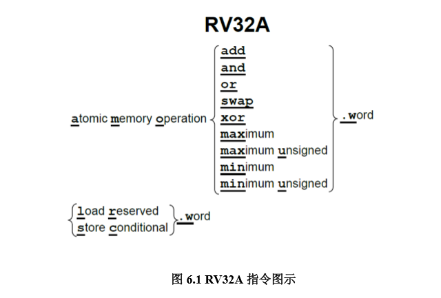
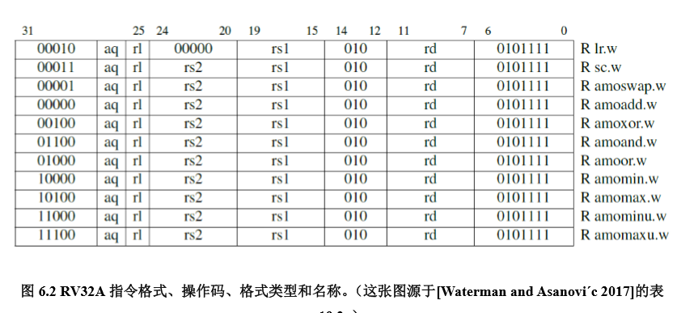
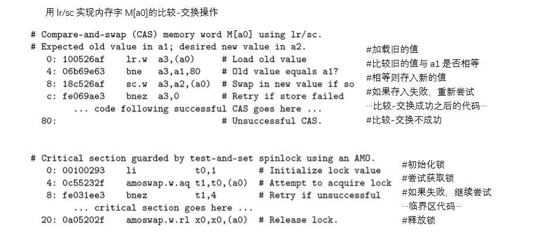

# 原子操作 (AMO)

​	其为附加指令

⚫ 内存原子操作（AMO）

⚫ 加载保留/条件存储（load reserved / store conditional） 

其操作不会在多进程中切换所打扰

1.AMO 指令对内存中的操作数执行一个原子操作，并将目标寄存器设置为操作前的内存 值。原子表示内存读写之间的过程不会被打断，内存值也不会被其它处理器修改

2.加载保留和条件存储保证了它们两条指令之间的操作的原子性。加载保留读取一个内存 字，存入目标寄存器中，并留下这个字的保留记录。而如果条件存储的目标地址上存在保留 记录，它就把字存入这个地址。如果存入成功，它向目标寄存器中写入 0；否则写入一个非 0 的错误代码。 

​       为什么 RV32A 要提供两种原子操作呢？

因为实际中存在两种不同的使用场景。 编程语言的开发者会假定体系结构提供了原子的比较-交换（compare-and-swap）操作： 比较一个寄存器中的值和另一个寄存器中的内存地址指向的值，

​					如果它们相等，将第三个寄 存器中的值和内存中的值进行交换。

这是一条通用的同步原语，其它的同步操作可以以它为 基础来完成。 

​		尽管将这样一条指令加入 ISA 看起来十分有必要，它在一条指令中却需要 3 个源寄存 器和 1 个目标寄存器。源操作数从两个增加到三个，会使得整数数据通路、控制逻辑和指令 格式都变得复杂许多。（RV32FD 的多路加法（multiply-add）指令有三个源操作数，但它影 响的是浮点数据通路，而不是整数数据通路。）不过，加载保留和条件存储只需要两个源寄 存器，用它们可以实现原子的比较交换

demo:

