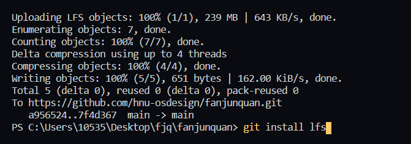

## 利用git LFS 传输大于100M的文件

### 1.安装git lfs

​	`git lfs install`

在vscode 直接安装

### 2.git init 

​	初始化仓库

### 3.选择你让git lfs 管理的文件

   1.`git lfs track "*.pdf"`

   2 . git add "..."

     3.  git commit -m
        4.   git push   ,然后等待即可