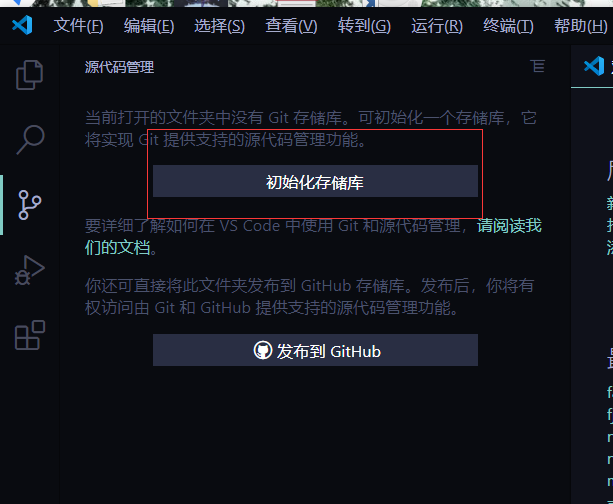
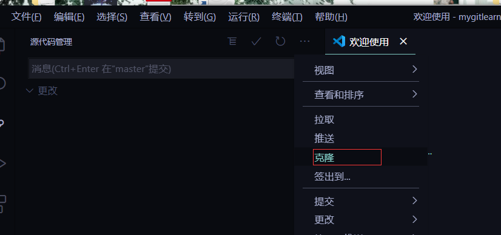

# 摘要:

介绍配合vscode利益git来远程控制github仓库。


# Git命令行

### 常见命令:

#### 本地

```git
git init

git status
	查看当前状态
	git status -s  简洁

git addgit
	#放入暂存取

git commit
	#提交
git restore

git  diff
	--比较文件区别

git checkout

git branch

git merge

git stash
```

#### 远程

```git
git clone
git pull
git push
```


# vscode启动配置:

### 1.创建一个文件夹"mygit"

### 2.再用vscode的方式打开文件夹

​			此时里面的是空的

### 3.初始化仓库

​			这里相当于`git init`



### 4.用户登录


点击用户登录,这里登录后可以免密git push和git pull 与远程仓库联系


#### 5.克隆仓库



可以选择clone自己的仓库或者用url和git克隆(就是下载)别人的仓库

然后选择保存的文件,

tip:这里注意,当前打开的vscode并不是工作目录,工作目录需要重新用那个仓库文件打开,此时才库进行接下里的暂存,提交,pull ,push等操作

### 6.pull操作

在工作前,最好把远程的代码先拉下来工作,否则push的时候会发生冲突

如果远程有更改,在pull的时候,会提供你给合并操作,你自己需要选择合并的方式,然后提交,

如果再次pull则会认为你已经知道更改过的,所以不会覆盖本地仓库,

### 7.暂存操作

也就是git add 操作,将修改好内容,提交的暂存区,可以打开看修改了哪里做对比

### 8.提交

也就是git commit 操作,将所有的暂存提交,这里提交指的是提交的本地仓库,还没有push到远程仓库

### 10 push

这里直接推送到远程仓库,


