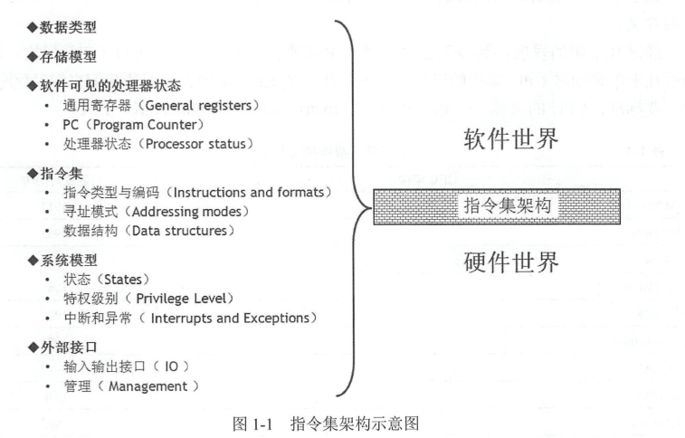

# CPU架构简介

1.目前有的架构:x86,arm.misps....

2.复杂指令集(CISC)和精简指令集(RISC)

CISC代表:x86

RISC代表:arm mips

- 和 CISC 相比，其优点如下：
- 1）RISC 更能`充分利用 VLSI 芯片的面积`。CISC 的控制器大多数采用微程序控制，其控制存储器在 CPU 芯片内所占面积达 `50% 以上`，而 RISC 控制器采用组合逻辑控制，其硬布线逻辑只占 CPU 芯片面积的 `10% 左右`。
- 2）RISC 更能提高`运算速度`。RISC 的指令数、寻址方式和指令格式种类少，又设有多个通用寄存器，采用流水线技术，所以运算速度更快，大多数指令在`一个时钟周期内完成`。
- 3）RISC `便于设计，可降低成本，提高可靠性`。RISC 指令系统简单，因此机器设计周期短；其逻辑简单，因此可靠性高。
- 4）RISC 有`利于编译程序代码优化`。RISC 指令类型少，寻址方式少，使编译程序容易选择更有效的指令和寻址方式，并适当地调整指令顺序，使得代码执行更高效化。

3.指令集有什么

