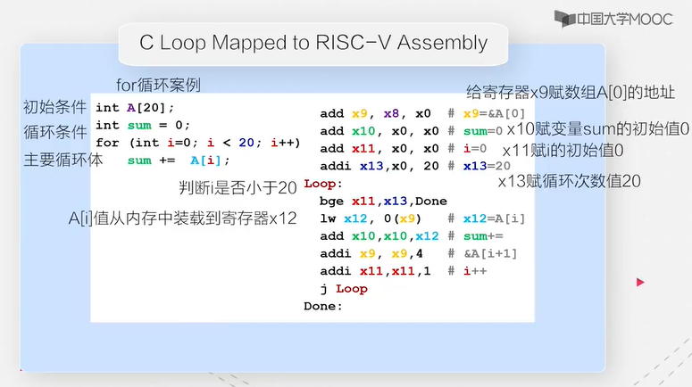
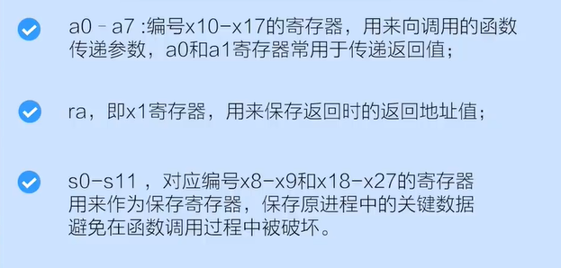
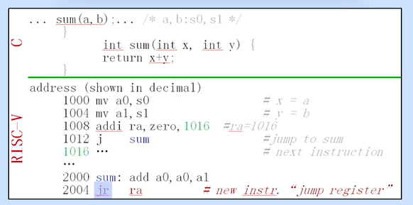
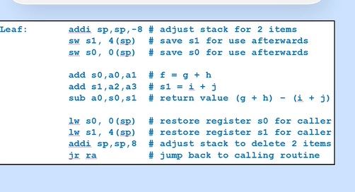
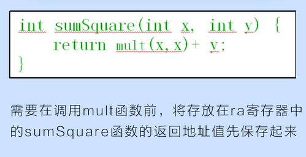
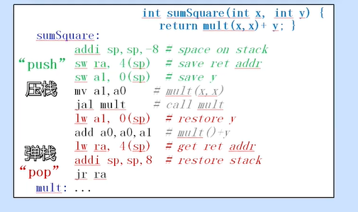
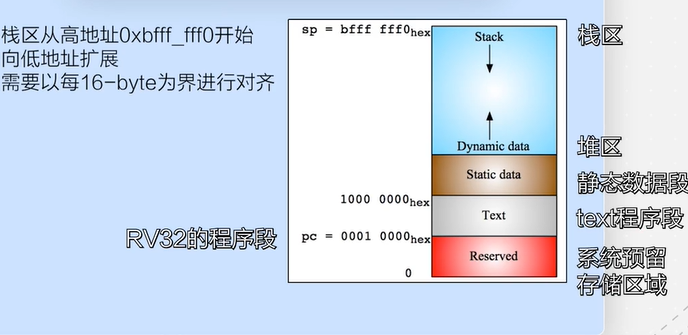
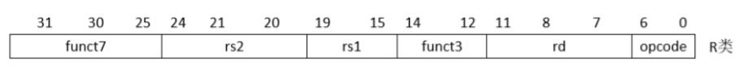

### 1.1课程介绍

### 2.1 算术指令

1. `add x1 x2  x3 `   ==  ` x1=x2+x3`

2. `x0`寄存器特别代表0

3. addi x1 x2 10  立即数操作  ,由于精简原因无subi ,因为可以由addi完成

4. 一共32哥寄存器, `x0-x31`   

   zero:x0

### 2.2访存指令

1. 32位,一个寄存器32位 也就是4个字节,也就是1 word

2. lw x10 12(x15)   #讲数据从存储器装载到寄存器   从右到左

3. sw x10   40(x15) #讲数据从寄存器装载到内存     从左到右

4. lb  sb  ,一个byte

   符号扩展:讲最高bit位复制到所有高bit位

​    lbu,无符号扩展:全0填充 ,,无sbu

### 2.3条件判断分支指令

beq  register1 register 2  L1  # 相等跳转L1

blt  ...

### 2.4 逻辑运算指令

### 2.5函数调用

1.象征性的寄存器名称

a0-a7 for argument registers(x10-x17)

zero for x0

2.伪指令

​	mv rd ...

函数调用实例:

jal指令为:跳转并链接  :保存下一个地址到ra,然后跳转

jr指令:跳转到寄存器所对应的空间 ,也可以用ret表示

### 2.6 栈的使用

为了让寄存器存方局部变量:

在进入函数后,开辟一个能够保存寄存器原值的空间,在函数返回时重装这些原值,然后释放

sp寄存器(x2) 栈指针寄存器

demo:

递归demo

为了减少寄存器保存时候的消耗

分成  1.函数调用时保留的寄存器: sp,gp,tp

​		 2.函数调用不保存的寄存器:a0-a7  ra  t0-t6

栈区位置:

### 3.1 R型操作指令

R指令共有6个域

操作位为: 011011(2)

eg: add  x19 x8  x10

### 3.2 I型指令和S型指令

### 3.3 B型指令和U型指令

### 3.4 J型指令

### 4.1 数据通路的基本模块

### 4.2 R 型指令和I型

### 4.3 I型访存指令和S型指令

### 4.4 B型指令、I型指令

